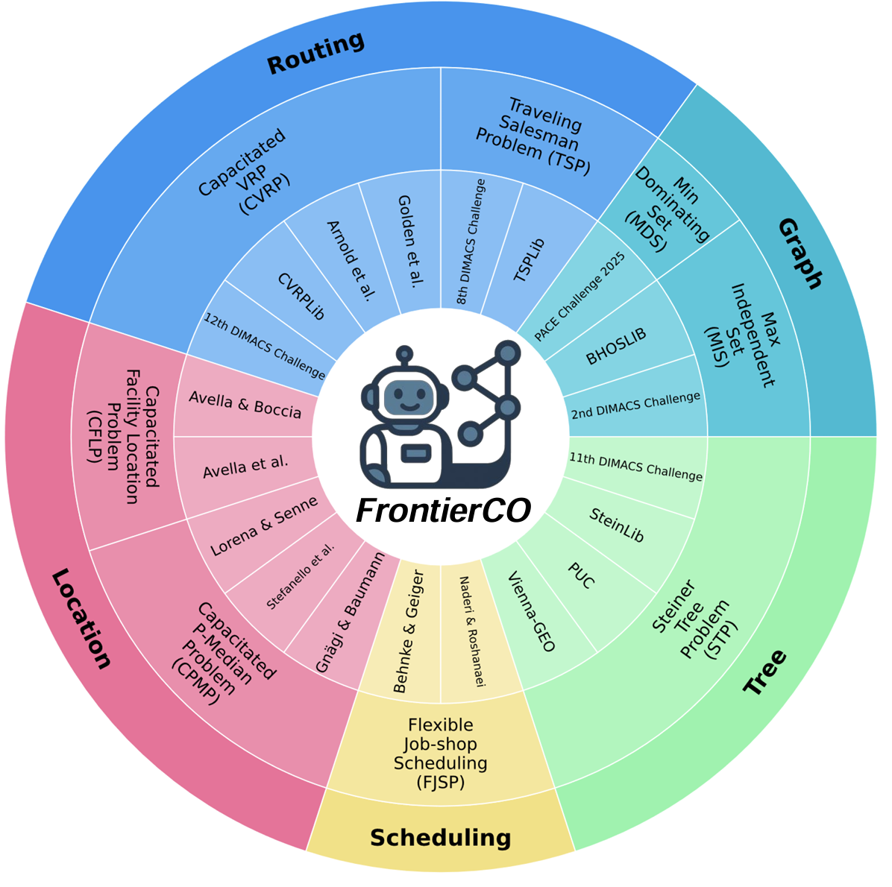

# FrontierCO: A Comprehensive Evaluation of Contemporary ML-Based Solvers for Combinatorial Optimization
<p align="center">

</p>
FrontierCO is a curated benchmark suite for evaluating ML-based solvers on large-scale and real-world Combinatorial Optimization (CO) problems. The benchmark spans 8 classical CO problems across 5 application domains, providing both training and evaluation instances specifically designed to test the contemporary ML-based CO solvers in solving NP-hard problems.

Combinatorial optimization plays a fundamental role in discrete mathematics, computer science, and operations research, with applications in routing, scheduling, allocation, and more. As ML-based solvers evolve—ranging from neural networks to symbolic reasoning with large language models—FrontierCO offers the first comprehensive dataset suite tailored to test these solvers at realistic scales and difficulties.

See more details about FrontierCO in our [paper](https://arxiv.org/pdf/2505.16952). Please contact shengyuf@cs.cmu.edu or weiweis@cs.cmu.edu.


# Download Data
Download the raw data from [https://huggingface.co/datasets/CO-Bench/FrontierCO](https://huggingface.co/datasets/CO-Bench/FrontierCO) to the local directory `data`
```python
from huggingface_hub import snapshot_download

snapshot_download(
    repo_id='CO-Bench/FrontierCO',
    repo_type='dataset',
    local_dir='data'
)
```

# Classical Solvers and Neural Training Data

Please refer to the instructions under each problem folder under [data](https://github.com/sunnweiwei/FrontierCO/tree/main/data) for how to: 

- apply the human-designed classical solvers 
- generate the training data for neural solvers 

All the neural solvers evaluated in this work are open-sourced models. Please refer to their official GitHub repos for the training and evaluation code.

# Neural Solver Evaluation


# Agent Evaluation

Check out [Evaluation-on-Frontierco](https://github.com/sunnweiwei/CO-Bench?tab=readme-ov-file#evaluation-on-frontierco)

Below is code to run evaluation of *Greedy Refinement* agent on `CFLP` for 64 iterations with 300s timeout.

```python
# We use new agent implementations in FrontierCO:
from agents import YieldGreedyRefine, YieldFunSearch, YieldReEvo

# And a new evaluator to fetch solutions yielded by the solver,
# evaluating only the last solution before timeout:
from evaluation import YieldingEvaluator, get_new_data

# Load data
data = get_new_data(task, src_dir='data', data_dir='data')

# Define agent (example: YieldGreedyRefine)
agent = YieldGreedyRefine(
    problem_description=data.problem_description,
    timeout=300,  # 300s timeout during solver development
    model='openai/o3-mini',  # We use LiteLLM to call the API
)

# Load YieldingEvaluator
# 300s timeout during solver development
evaluator = YieldingEvaluator(data, timeout=300)

# Run for 64 iterations
for it in range(64):
    code = agent.step()
    if code is None:  # agent decides to terminate
        break
    feedback = evaluator.evaluate(code)  # Run evaluation
    agent.feedback(feedback.dev_score, feedback.dev_feedback)  # Use dev set score as feedback

# Get the final solution
code = agent.finalize()

# For final evaluation, run the solver for 1 hour
final_evaluator = YieldingEvaluator(data, timeout=60 * 60)
feedback = final_evaluator.evaluate(code)
print(feedback.test_feedback)  # Test set score
```

# Agent Implementations

Agents are implemented in the `agents` module. Currently supported agents include: `GreedyRefine`, `DirectAnswer`, `BestOfN`, `FunSearch` ([link](https://github.com/google-deepmind/funsearch)), `AIDE` ([link](https://github.com/WecoAI/aideml)), `ChainOfExperts` ([link](https://github.com/xzymustbexzy/Chain-of-Experts)), and `ReEvo` ([link](https://github.com/ai4co/reevo)). LLMs are supported via [liteLLM](https://github.com/BerriAI/litellm).

Each agent implements the following functions:
- `step()`: Returns the next candidate code for evaluation.

# Citation
```
@misc{feng2025comprehensiveevaluationcontemporarymlbased,
      title={A Comprehensive Evaluation of Contemporary ML-Based Solvers for Combinatorial Optimization}, 
      author={Shengyu Feng and Weiwei Sun and Shanda Li and Ameet Talwalkar and Yiming Yang},
      year={2025},
      eprint={2505.16952},
      archivePrefix={arXiv},
      primaryClass={cs.LG},
      url={https://arxiv.org/abs/2505.16952}, 
}
```

